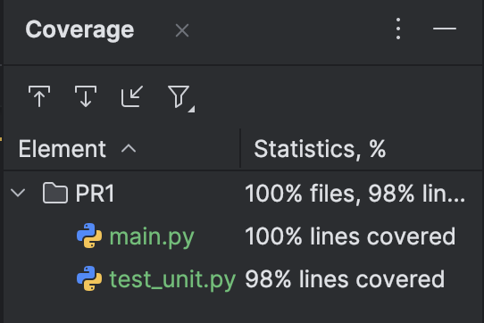

## Приложение можно запустить:

- Для обработки файла с заданным словом:
  ```bash
  python main.py <файл> <слово>
  ```
  Пример:
  ```bash
  python main.py ./test_cases/test.txt world
  ```

- Для тестирования с использованием `unittest`:
  ```bash
  python -m unittest
  ```

- Для тестирования с покрытием:
  ```bash
  coverage run -m unittest discover && coverage report
  ```

## Структура проекта

- `main.py` — основной файл приложения.
- `test_cases/` — директория с тестовыми данными.
- `tests.py` — файл с юнит-тестами.


