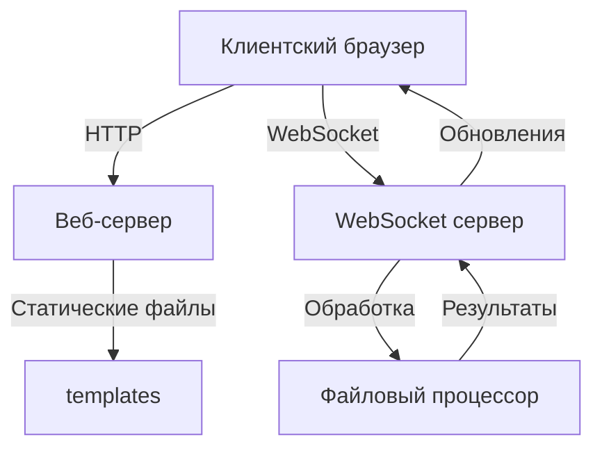
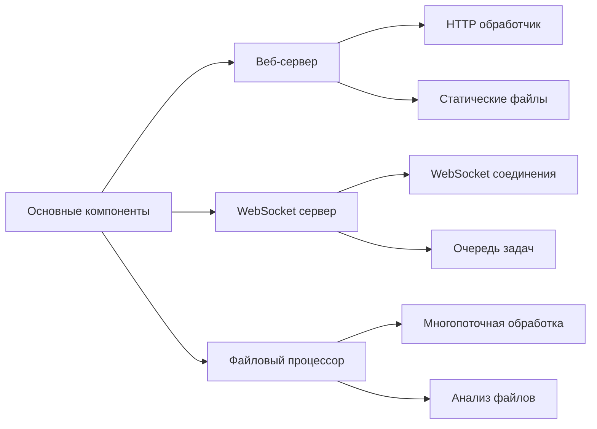
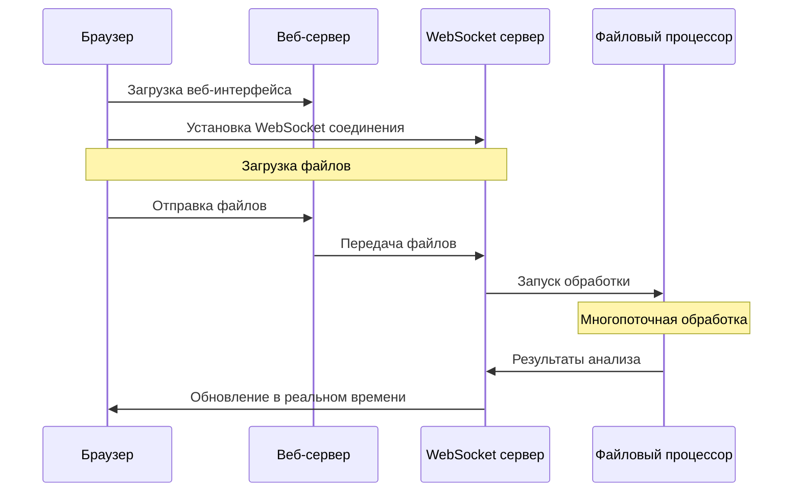

# Многопоточное сетевое приложение с WebSocket

## Архитектура системы



## Компоненты системы



## Описание сервиса

### Общее описание
Сервис представляет собой многопоточное сетевое приложение, реализующее клиент-серверную архитектуру с использованием WebSocket для анализа текстовых файлов. Система состоит из двух основных серверов: HTTP-сервера для веб-интерфейса и WebSocket-сервера для обработки файлов.

### Основные компоненты

#### 1. Веб-сервер (web_server.py)
- Реализует HTTP-сервер для обслуживания веб-интерфейса
- Обрабатывает статические файлы из директории templates
- Предоставляет интерфейс для загрузки файлов
- Поддерживает drag-and-drop функциональность

#### 2. WebSocket сервер (server.py)
- Управляет WebSocket соединениями с клиентами
- Координирует обработку файлов
- Отправляет результаты анализа в реальном времени
- Использует асинхронное программирование

#### 3. Файловый процессор
- Реализует многопоточную обработку файлов
- Выполняет анализ текстовых файлов:
  - Подсчет слов
  - Подсчет символов
  - Подсчет строк
- Использует мьютексы для синхронизации данных

### Процесс работы



### Технические особенности

#### Многопоточность
- Использование ThreadPoolExecutor для параллельной обработки файлов
- Синхронизация доступа к общим ресурсам через мьютексы
- Эффективное распределение задач между потоками

#### Асинхронность
- Асинхронная обработка WebSocket соединений
- Неблокирующая обработка HTTP запросов
- Реал-тайм обновление результатов

#### Безопасность
- Валидация загружаемых файлов
- Ограничение размера файлов
- Безопасная обработка ошибок

### Требования к системе

#### Программные требования
- Python 3.7+
- Библиотеки:
  - websockets
  - aiohttp
  - concurrent.futures
  - threading

#### Системные требования
- Доступ к портам (по умолчанию 8000 для веб-сервера)
- Достаточно места на диске для временных файлов
- Поддержка многопоточности

### Установка и запуск

1. Создание виртуального окружения:
```bash
python -m venv venv
source venv/bin/activate  # Linux/Mac
venv\Scripts\activate     # Windows
```

2. Установка зависимостей:
```bash
pip install -r requirements.txt
```

3. Запуск серверов:
```bash
# Терминал 1: WebSocket сервер
python server.py

# Терминал 2: Веб-сервер
python web_server.py
```

4. Доступ к сервису:
```
http://localhost:8000
```

### Тестирование

Система включает модульные и интеграционные тесты:
- Тесты веб-сервера
- Тесты WebSocket функциональности
- Тесты обработки файлов

Запуск тестов:
```bash
python -m unittest discover -p "test_*.py" -s PR2/test
```

### Мониторинг и отладка

- Логирование операций в директории logs/
- Отслеживание состояния WebSocket соединений
- Мониторинг производительности обработки файлов 