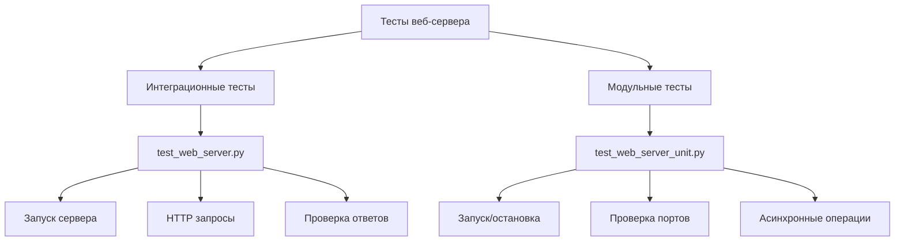
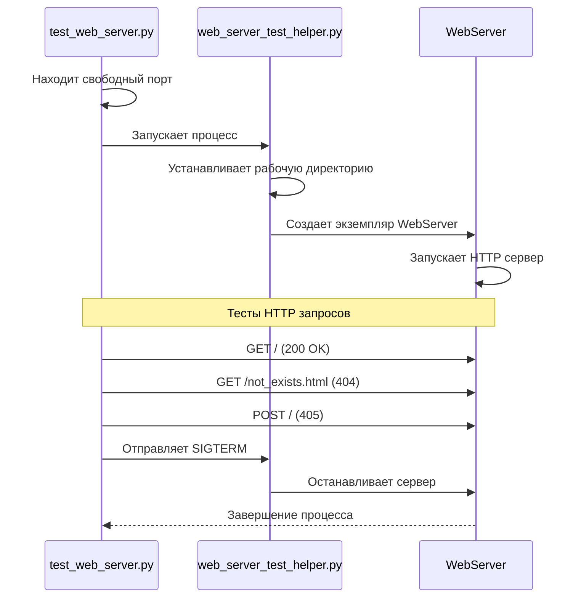
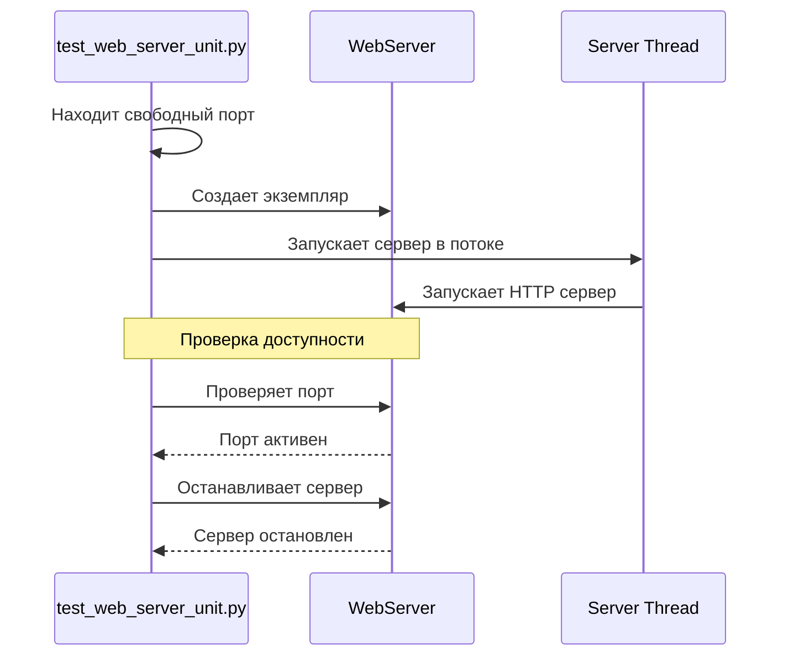
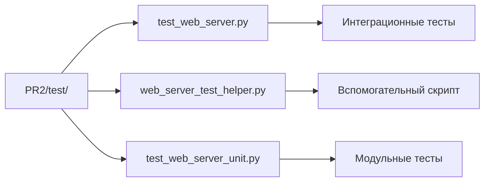

# Тестирование веб-сервера

## Общая структура тестов



## Процесс интеграционного тестирования



## Процесс модульного тестирования



## Структура файлов



## Описание тестов

### Интеграционные тесты (test_web_server.py)

Тесты проверяют полный цикл работы веб-сервера:
- Запуск сервера в отдельном процессе
- Обработка HTTP запросов
- Корректность ответов
- Завершение работы

Основные проверки:
- GET запрос к корневому пути (200 OK)
- GET запрос к несуществующему файлу (404)
- POST запрос (405 Method Not Allowed)

### Модульные тесты (test_web_server_unit.py)

Тесты проверяют внутреннюю функциональность класса WebServer:
- Запуск сервера
- Проверка доступности порта
- Остановка сервера
- Асинхронные операции

### Вспомогательный скрипт (web_server_test_helper.py)

Скрипт для запуска сервера в отдельном процессе:
- Установка рабочей директории
- Обработка сигналов завершения
- Запуск сервера с указанным портом

## Запуск тестов

### Запуск всех тестов
```bash
python3 -m unittest discover -p "test_web_server*.py" -s PR2/test
```

### Запуск интеграционных тестов
```bash
python3 -m PR2.test.test_web_server
```

### Запуск модульных тестов
```bash
python3 -m PR2.test.test_web_server_unit
```

## Требования к окружению

- Python 3.9+
- Библиотека requests
- Доступ к портам (динамическое выделение)
- Директория templates с index.html 